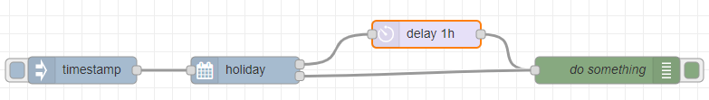

# node-red-contrib-holiday

This is my first node red contribution. Pull requests are welcome if you have any improvements! :ok_hand:

This node uses the [date-holidays](https://www.npmjs.com/package/date-holidays) npm package to look up which days are holidays. 

You can easily select which types of holidays to include, and also add weekends or any days of the week to include.

This node has two outputs: the top output will be triggered when the input date is a match for holiday or weekend, and the bottom output will be triggered when it's not a match.
The top node will also add two properties:
* **weekend** is true if the day matches your preset weekend-days, false if not
* **holiday** holds details from the underlying library about the holiday, including the name and the type (public, bank, observance etc)

Example usage will be to stop the flow if it is a non-work day, or delay actions on weekends.

